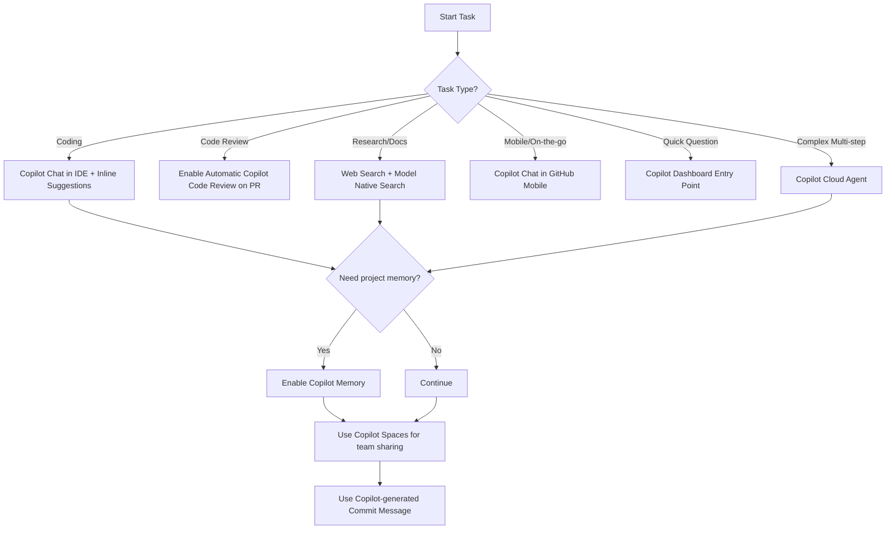

# GitHub Copilot Integration Guide for JachaiX

## Purpose
This guide helps the JachaiX team use GitHub Copilot features efficiently for a Bangla-first, multimodal trust and fact-checking platform.

## JachaiX Context
- **Domain:** Fact-checking and trust scoring for Bangladesh
- **Core requirements:** Bangla language quality, cultural context, privacy-safe processing, explainable outputs
- **Stack focus:** Python, PHP (Laravel), TypeScript, Jupyter notebooks

---

## 1) Tool Overview (What each Copilot feature is best for)

| Feature | What it does | Best use in JachaiX |
|---|---|---|
| Copilot in GitHub Desktop | Suggests commit messages and supports Git workflows | Faster, clearer commits for feature/test/doc changes |
| Copilot Chat in IDE | Interactive coding assistant in VS Code/JetBrains | Designing and implementing pipelines, APIs, tests |
| Copilot Chat in GitHub Mobile | Mobile chat for repo questions | Quick status checks, PR clarifications on the go |
| Copilot Web Search (Bing-powered) | Current web-backed answers with sources | Latest fact-check methods, Bangla NLP package checks |
| Copilot Model Native Search (Preview) | Search/code understanding using model context | Find similar retrieval, ranking, OCR, moderation patterns |
| Evaluation Models in Auto Model Selection (Preview) | Model comparison in Copilot workflows | Choose best model style for Python/PHP/TS tasks |
| Dashboard Entry Point | Central launch point for Copilot tools | Quick question routing to the right Copilot mode |
| Copilot Code Review & Automatic PR Review | AI review for PR diffs | Catch logic gaps, risky assumptions, missing tests |
| Copilot Cloud Agent | Agentic task execution in GitHub | Multi-step refactors, doc generation, repetitive updates |
| Copilot Memory (Preview) | Cross-session context retention | Preserve project conventions and Bangla-specific constraints |
| MCP Servers Integration | Tool/plugin protocol integration | Connect to JachaiX MCP services for docs/ops/fact-check flows |
| Copilot-generated Commit Messages | Auto-draft commit summaries | Standardize history with low overhead |
| Copilot Spaces & Individual Access/Sharing | Shared context spaces for teams | Team prompts, reusable playbooks, onboarding context |
| Suggestions from Public Code | Pattern suggestions learned from public repos | Bootstrap implementation ideas (then adapt to JachaiX context) |

---

## 2) Project-Specific Use Cases by Tech Stack

### Python Development (78.1%)
Use Copilot Chat + inline completion for:
- Fact-checking algorithm design (`claim parsing -> evidence retrieval -> scoring -> verdict`)
- ML model training/evaluation scripts
- Data ingestion and processing pipelines
- API endpoint prototyping and validation
- Unit/integration test skeleton generation

**Example prompt:**
> "Generate a Python function that computes a trust score from source reliability, evidence agreement, and uncertainty; include type hints and pytest tests."

### PHP Backend (8.1%)
Use Copilot for:
- Laravel controller/service/repository scaffolding
- Query optimization suggestions for MySQL usage
- External API integration wrappers with retries and error handling

**Example prompt:**
> "Refactor this Laravel query for performance and add pagination + safe filters."

### TypeScript / Frontend (6.8%)
Use Copilot for:
- Fact-checking UI components and moderation views
- Bangla text display/normalization helpers
- Multimodal upload and result rendering logic

**Example prompt:**
> "Create a TypeScript component for showing verdict, confidence, and evidence sources with loading/error states."

### Jupyter Notebooks (2.9%)
Use Copilot for:
- Exploratory data analysis and charting
- Experiment notebooks for model tuning
- Research notes with reproducible code cells

**Example prompt:**
> "Build a notebook section that compares precision/recall/F1 for three trust-score variants and plots confusion matrices."

---

## 3) When to Use Which Feature (Decision Flow)

---

## 4) Practical Setup Checklist

1. Enable Copilot in your IDE and GitHub account.
2. Enable **Copilot Memory** for cross-session context.
3. Enable **Automatic Copilot PR Review** in repo settings.
4. Configure IDE-level settings (see `.vscode/settings.json` and `.idea/copilot-settings.xml`).
5. Use **Copilot Spaces** for reusable team prompts/workflows.
6. Use MCP-enabled workflows when interacting with JachaiX services.

---

## 5) Bangla + English Prompting Tips

- Be explicit about language requirements:
  - **EN:** "Keep output bilingual (Bangla + English)"
  - **BN:** "আউটপুট বাংলায় দিন, সাথে ছোট ইংরেজি ব্যাখ্যা দিন"
- Ask for edge cases:
  - mixed-script text, transliteration, unicode normalization
- Ask for explainability:
  - source list, confidence rationale, uncertainty flags

---

## 6) Suggested Team Policy

- Require human review for trust-score or moderation logic.
- Use Copilot Code Review for every PR, but treat as assistant (not final authority).
- Avoid sharing sensitive user data in prompts.
- Keep Copilot Memory updated with stable project conventions.

---

## 7) Official References

- GitHub Copilot docs: https://docs.github.com/en/copilot
- Copilot Chat: https://docs.github.com/en/copilot/using-github-copilot/asking-github-copilot-questions-in-your-ide
- Copilot code review: https://docs.github.com/en/copilot/using-github-copilot/code-review/using-copilot-code-review
- Copilot for pull requests: https://docs.github.com/en/copilot/using-github-copilot/using-github-copilot-for-pull-requests
- Copilot in GitHub Mobile: https://docs.github.com/en/copilot/using-github-copilot/using-github-copilot-in-github-mobile
- MCP overview: https://modelcontextprotocol.io/
